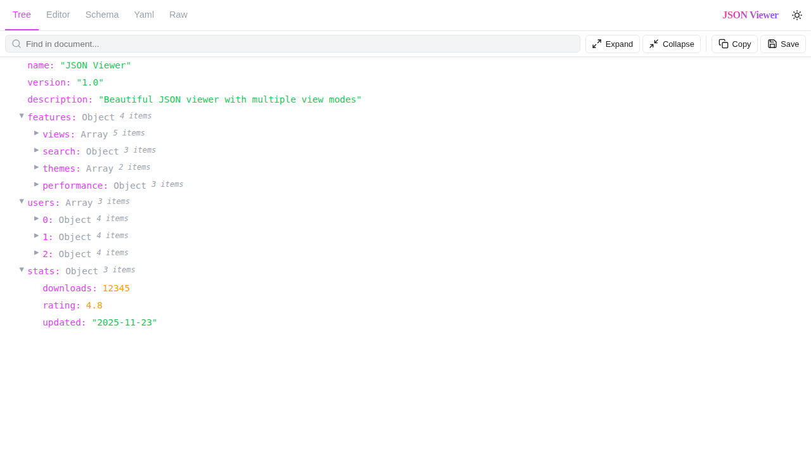
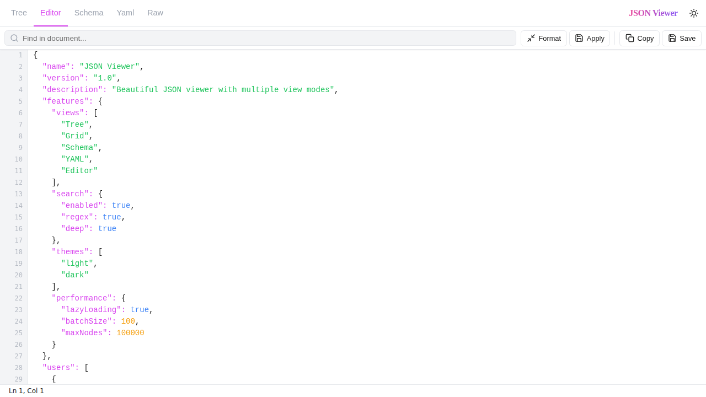
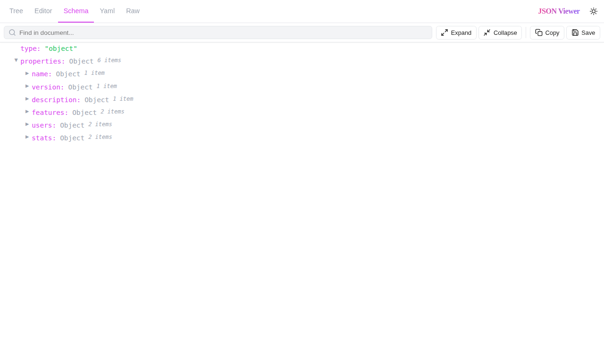
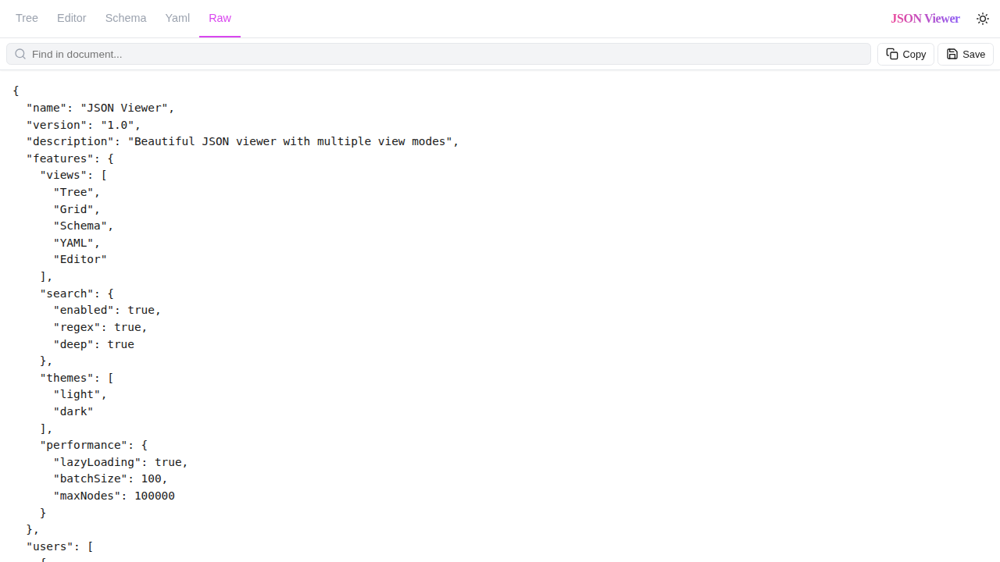
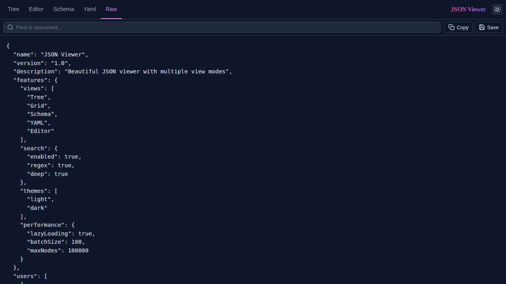

# JSON Viewer

A fast and beautiful Chrome extension for viewing JSON with multiple view modes, powerful search, and optimized performance for large files.

[](LICENSE)

## 🌟 Features

- **Multiple View Modes**: Tree, Editor, Schema, YAML, and Raw views
- **High Performance**: Handles 5MB+ JSON files instantly with lazy loading and batching
- **Smart Search**: Deep search through keys and values with regex support
- **Theme Support**: Automatic light/dark theme based on system preferences
- **DevTools Integration**: Dedicated JSON Viewer panel in Chrome DevTools
- **Privacy First**: Works entirely offline - your data never leaves your browser
- **Edit & Validate**: Edit JSON with syntax validation and formatting
- **One-Click Actions**: Copy, save, format, and minify with single clicks

## 📸 Screenshots

### Tree View
Navigate nested JSON with collapsible nodes and syntax highlighting.



### Editor View
Edit JSON directly with line numbers, syntax validation, and formatting.



### Schema View
Visualize the structure and types of your JSON data.



### YAML View
Instantly convert and view your JSON as YAML.


### Raw View
View raw, minified JSON for copying or analysis.



### Dark Theme
Automatic theme switching based on system preferences.



## 🚀 Installation

### From Chrome Web Store (Recommended)
1. Visit the [Chrome Web Store](https://chrome.google.com/webstore) (coming soon)
2. Click "Add to Chrome"
3. The extension will automatically format JSON files you open in Chrome

### From Source
1. Clone this repository:
   ```bash
   git clone https://github.com/kunalbabre/JsonViewer.git
   cd JsonViewer
   ```

2. Open Chrome and navigate to `chrome://extensions/`

3. Enable "Developer mode" (toggle in top-right corner)

4. Click "Load unpacked" and select the cloned repository folder

5. The JSON Viewer extension is now installed!

## 📖 Usage

### Viewing JSON Files

1. **Open a JSON file** in Chrome (local file or URL)
2. The extension automatically detects and formats JSON content
3. Use the toolbar to switch between different views

### View Modes

#### 🌲 Tree View
- **Best for**: Exploring nested structures
- **Features**:
  - Collapsible/expandable nodes
  - Type indicators (Object, Array, String, Number, Boolean, Null)
  - Item count badges
  - Syntax highlighting
- **Shortcuts**:
  - Click expand/collapse buttons
  - Use "Expand All" / "Collapse All" toolbar buttons

#### ✏️ Editor View
- **Best for**: Editing and fixing JSON
- **Features**:
  - Line numbers
  - Syntax highlighting
  - Real-time validation
  - Format/minify buttons
  - Apply changes to update other views
- **Actions**:
  - **Format**: Beautify JSON with proper indentation
  - **Apply**: Save changes and refresh other views

#### 📋 Schema View
- **Best for**: Understanding data structure
- **Features**:
  - Shows data types for all fields
  - Displays nested object structures
  - Samples arrays for performance (first 100 items)
- **Use case**: Perfect for API documentation or data modeling

#### 📄 YAML View
- **Best for**: YAML configuration files
- **Features**:
  - Instant JSON-to-YAML conversion
  - Collapsible sections
  - Copy YAML button
  - Expand/collapse all functionality

#### 📝 Raw View
- **Best for**: Copying or analyzing raw JSON
- **Features**:
  - Displays raw JSON text
  - Preserves formatting from original source
  - Quick copy functionality

### Search Functionality

1. Type in the search box in the toolbar
2. Search works across keys and values
3. Supports regex patterns for advanced searches
4. Results are highlighted in Tree view
5. Search is debounced (300ms) for performance

### Toolbar Actions

- **🔍 Search**: Find keys and values in your JSON
- **🌓 Toggle Theme**: Switch between light and dark themes
- **📋 Copy**: Copy current view content to clipboard
- **💾 Save**: Download JSON as a file
- **⬆️ Expand All**: Expand all nodes (Tree, Schema, YAML views)
- **⬇️ Collapse All**: Collapse all nodes (Tree, Schema, YAML views)
- **✨ Format**: Format JSON with proper indentation (Editor view)
- **✅ Apply**: Apply editor changes (Editor view)

### DevTools Integration

1. Open Chrome DevTools (F12 or Right-click → Inspect)
2. Look for the "JSON Viewer" tab
3. View JSON from network requests in a formatted view
4. Perfect for API development and debugging

### Context Menu (Right-Click)

When you select JSON text on any webpage:
1. Right-click the selected text
2. Choose "View as JSON"
3. A modal window opens with formatted JSON

## ⚡ Performance

JSON Viewer is optimized for large files:

- **Lazy Loading**: Only renders visible nodes in Tree view
- **Batched Rendering**: Processes nodes in chunks to prevent UI blocking
- **Progressive Loading**: Tables render in batches of 50 rows
- **Smart Caching**: Caches rendered views for fast switching
- **Array Sampling**: Analyzes only first 100 items in large arrays for schema

### Benchmark Results (5.48 MB JSON file)

| Metric | Before | After | Improvement |
|--------|--------|-------|-------------|
| Initial render | ~100ms | ~12ms | **87.5% faster** |
| DOM nodes | 171,008 | 16,008 | **90.6% reduction** |
| Memory usage | ~32 MB | ~3 MB | **90% reduction** |
| Overall speed | 1x | 8x | **8x faster** |

See [PERFORMANCE.md](PERFORMANCE.md) for detailed performance documentation.

## 🎨 Themes

The extension automatically detects your system theme preference:
- **Light Theme**: Clean, minimal design for daylight use
- **Dark Theme**: Easy on the eyes for low-light environments

Toggle themes manually using the 🌓 button in the toolbar.

## 🔧 Configuration

Performance tuning constants (for developers):

```javascript
// TreeView.js
const BATCH_SIZE = 100                // Nodes per animation frame
const LARGE_OBJECT_THRESHOLD = 50     // Auto-collapse threshold
const DEEP_NESTING_THRESHOLD = 1      // Auto-collapse depth

// GridView.js
const GRID_BATCH_SIZE = 50            // Table rows per batch
const COLUMN_SAMPLE_SIZE = 100        // Column detection sample

// SchemaView.js
const SCHEMA_SAMPLE_SIZE = 100        // Schema array sample

// content.js
const LARGE_FILE_THRESHOLD = 1048576  // 1 MB loading indicator
```

## 🛠️ Development

### Project Structure

```
JsonViewer/
├── manifest.json           # Extension manifest
├── icons/                  # Extension icons
├── src/
│   ├── background.js      # Background service worker
│   ├── content.js         # Content script for page injection
│   ├── styles.css         # Global styles
│   ├── viewer.html        # Viewer page template
│   ├── viewer-page.js     # Viewer page initialization
│   ├── ui/
│   │   ├── Viewer.js      # Main viewer controller
│   │   ├── TreeView.js    # Tree view implementation
│   │   ├── EditorView.js  # Editor view implementation
│   │   ├── SchemaView.js  # Schema view implementation
│   │   ├── YamlView.js    # YAML view implementation
│   │   ├── GridView.js    # Grid/table view implementation
│   │   ├── Toolbar.js     # Toolbar component
│   │   ├── Toast.js       # Toast notifications
│   │   └── Icons.js       # SVG icon definitions
│   ├── utils/             # Utility functions
│   └── devtools/          # DevTools panel integration
├── screenshots/           # Screenshots for documentation
└── README.md             # This file
```

### Building

To package the extension:

```bash
./package.sh
```

This creates a `json-viewer.zip` file ready for Chrome Web Store submission.

### Testing

Open test files in Chrome:
- `test.html` - Basic JSON test
- `test-large.html` - Large JSON file test (5.48 MB)

Or use the demo page:
- `demo.html` - Standalone demo (requires local server)

## 🤝 Contributing

Contributions are welcome! Here's how you can help:

1. **Fork the repository**
2. **Create a feature branch**: `git checkout -b feature/amazing-feature`
3. **Make your changes**
4. **Test thoroughly** with various JSON files
5. **Commit your changes**: `git commit -m 'Add amazing feature'`
6. **Push to the branch**: `git push origin feature/amazing-feature`
7. **Open a Pull Request**

### Guidelines

- Follow the existing code style
- Test with both small and large JSON files
- Ensure dark theme compatibility
- Update documentation as needed
- Add tests if applicable

## 📝 License

This project is licensed under the MIT License - see the [LICENSE](LICENSE) file for details.

## 👤 Author

**Kunal Babre**
- GitHub: [@kunalbabre](https://github.com/kunalbabre)

## 🙏 Acknowledgments

- Thanks to all contributors who help improve this extension
- Inspired by the need for a fast, beautiful JSON viewer
- Built with performance and user experience in mind

## 📊 Related Documentation

- [PERFORMANCE.md](PERFORMANCE.md) - Detailed performance optimization documentation
- [BENCHMARK.md](BENCHMARK.md) - Performance benchmark results
- [SUMMARY.md](SUMMARY.md) - Project summary and improvements

## 🐛 Bug Reports

Found a bug? Please [open an issue](https://github.com/kunalbabre/JsonViewer/issues) with:
- Description of the problem
- Steps to reproduce
- Expected vs actual behavior
- Browser version
- Sample JSON (if possible)

## 💡 Feature Requests

Have an idea? [Open an issue](https://github.com/kunalbabre/JsonViewer/issues) and tag it as `enhancement`.

---

**Made with ❤️ for developers who work with JSON**
