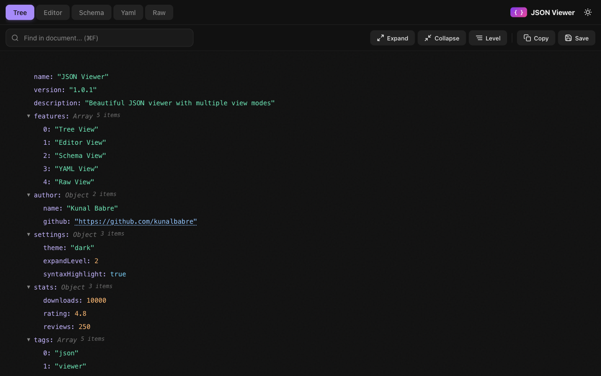
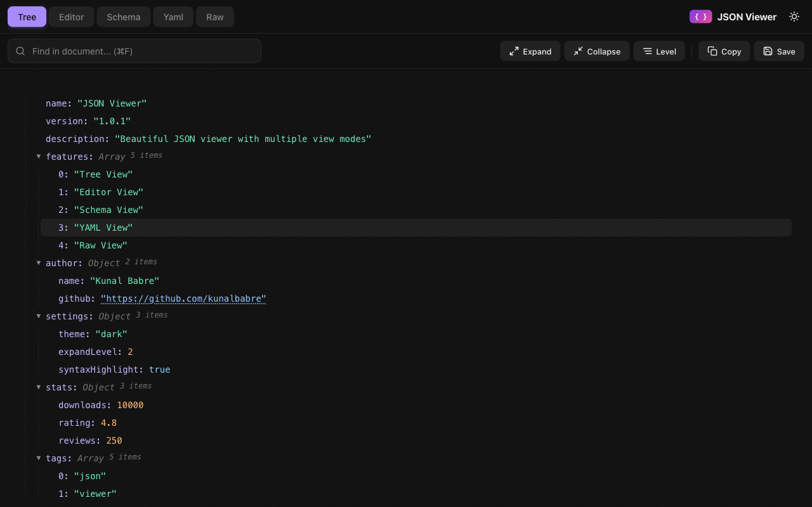
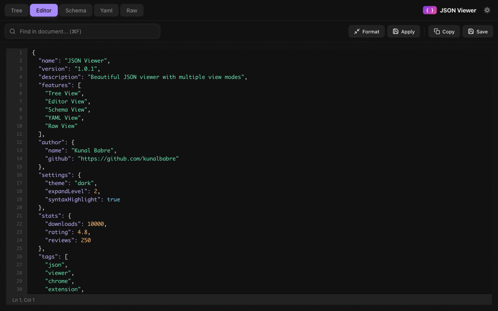
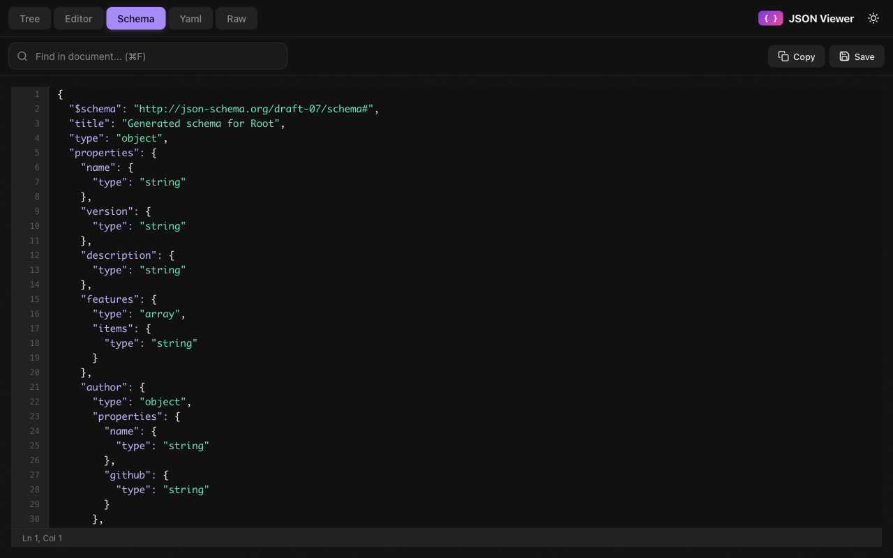
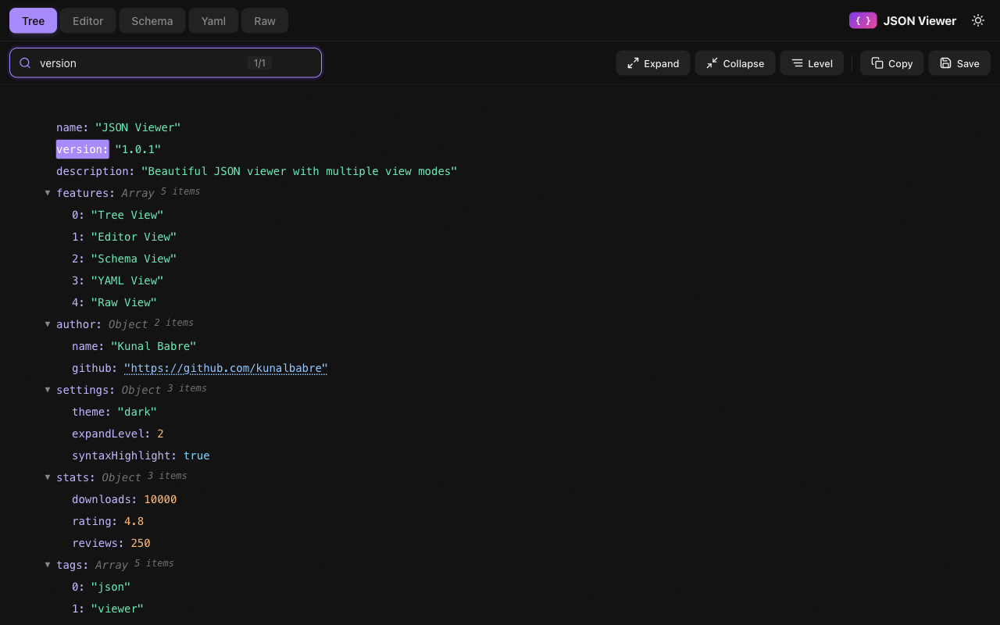
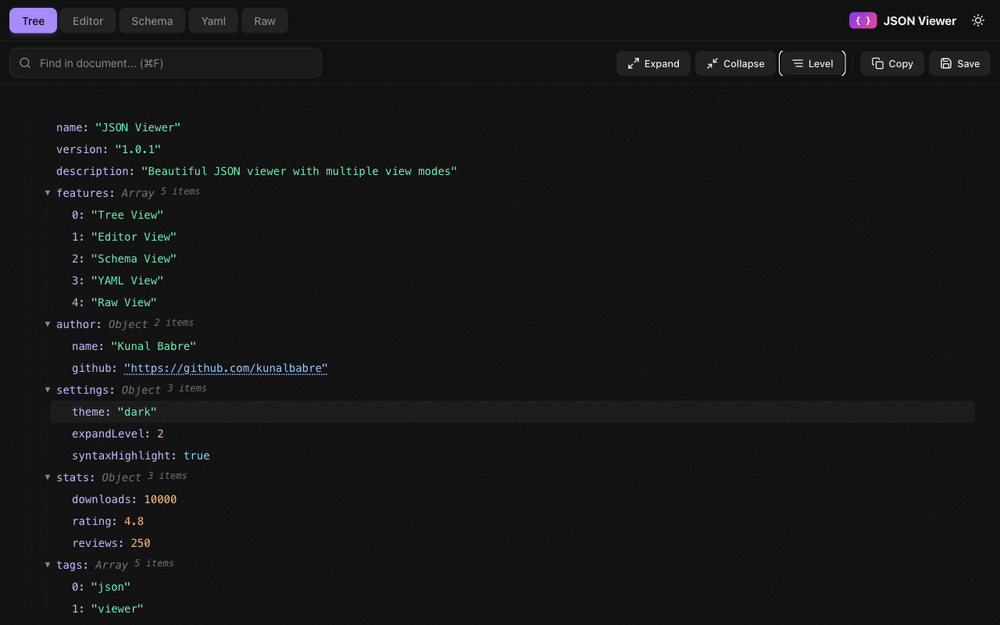

# JSON Viewer

**Transform raw JSON into something beautiful.**

A high-performance Chrome extension that makes JSON readable, navigable, and editable - right in your browser.

[](LICENSE)
[](https://chromewebstore.google.com/detail/json-viewer/cpjmnaccoabkopabenjobiimlppmmpjn)



---

## Install

**[Install from Chrome Web Store](https://chromewebstore.google.com/detail/json-viewer/cpjmnaccoabkopabenjobiimlppmmpjn)** (Recommended)

Or load from source:
1. Clone: `git clone https://github.com/kunalbabre/JsonViewer.git`
2. Open `chrome://extensions/`
3. Enable "Developer mode"
4. Click "Load unpacked" and select the folder

---

## Features

### Five View Modes

Switch between views instantly with a single click:

| View | Description |
|------|-------------|
| **Tree** | Collapsible nodes with syntax highlighting. Perfect for exploring nested structures. |
| **Editor** | Full-featured JSON editor with line numbers, formatting, and validation. |
| **Schema** | Visualize data types and structure at a glance. |
| **YAML** | Instant JSON-to-YAML conversion for config files. |
| **Raw** | Original JSON string with easy copy option. |

#### Tree View

*Expand and collapse nodes to explore your JSON structure*

#### Editor View

*Edit JSON directly with syntax highlighting and line numbers*

#### Schema View

*Understand your data structure with type annotations*

#### YAML View

*View JSON converted to YAML format*

---

### Powerful Search

Find what you need instantly:



- Search across **keys and values**
- **Real-time highlighting** as you type
- Navigate matches with **Enter** / **Shift+Enter**
- **Regex support** for advanced queries

---

### Smart Controls



| Action | Shortcut | Description |
|--------|----------|-------------|
| **Copy** | `Ctrl/⌘+C` | Copy JSON to clipboard |
| **Save** | `Ctrl/⌘+S` | Download as .json file |
| **Format** | `Alt+Shift+F` | Pretty-print with indentation |
| **Find** | `Ctrl/⌘+F` | Focus search input |
| **Theme** | `Ctrl/⌘+D` | Toggle light/dark mode |

#### Level-Based Expand/Collapse


Expand or collapse all nodes to a specific depth level (1-5).

---

### DevTools Integration

A dedicated **JSON Viewer** panel in Chrome DevTools lets you:
- Monitor network requests with JSON responses
- Click any request to view formatted JSON
- Filter requests by URL or content type
- Paste JSON manually for quick viewing

---

### Performance Optimized

Built for speed with large files:

| Feature | Benefit |
|---------|---------|
| **Lazy rendering** | Only visible nodes hit the DOM |
| **Batched processing** | Prevents UI blocking on large files |
| **View caching** | Instant tab switching |
| **Virtual scrolling** | Handles 100,000+ nodes smoothly |

**Benchmark (5.5MB JSON file):**
- Initial render: **~12ms** (87% faster than naive approach)
- DOM nodes: **90% reduction** via lazy loading
- Memory: **~3MB** vs ~32MB traditional

---

### Works Everywhere

- **Auto-detects JSON** in browser tabs
- **Local files** - Open .json files directly
- **Context menu** - Right-click selected text → "View JSON Snippet"
- **Light & dark themes** - Matches system preference
- **100% offline** - No data sent anywhere

---

## Keyboard Shortcuts

| Shortcut | Action |
|----------|--------|
| `Ctrl/⌘ + F` | Focus search |
| `Enter` | Next search match |
| `Shift + Enter` | Previous search match |
| `Ctrl/⌘ + C` | Copy JSON |
| `Ctrl/⌘ + S` | Save to file |
| `Ctrl/⌘ + T` | Toggle theme |
| `Alt + Shift + F` | Format JSON (Editor) |
| `Ctrl/⌘ + Enter` | Apply changes (Editor) |

---

## Privacy

JSON Viewer works **100% offline**. Your data is processed locally and never sent anywhere. No tracking. No analytics. No servers.

---

## Development

### Project Structure

```
JsonViewer/
├── manifest.json           # Extension manifest (v3)
├── src/
│   ├── background.js       # Service worker
│   ├── content.js          # Page injection
│   ├── styles.css          # Global styles
│   ├── ui/                 # UI components
│   │   ├── Viewer.js       # Main controller
│   │   ├── TreeView.js     # Tree view
│   │   ├── EditorView.js   # Editor view
│   │   ├── SchemaView.js   # Schema view
│   │   ├── YamlView.js     # YAML view
│   │   ├── Toolbar.js      # Toolbar
│   │   └── Icons.js        # SVG icons
│   ├── utils/              # Utilities
│   └── devtools/           # DevTools panel
├── tests/                  # E2E tests
├── scripts/                # Build scripts
└── docs/                   # Documentation
```

### Scripts

```bash
npm test              # Run E2E tests
npm run test:devtools # Test DevTools panel
npm run doc           # Generate documentation & screenshots
./package.sh          # Package for Chrome Web Store
```

### Testing

```bash
# Run all tests
npm test

# Test specific features
node tests/e2e/editor-test.mjs
node tests/e2e/devtools-test.mjs
```

---

## Contributing

1. Fork the repository
2. Create a feature branch: `git checkout -b feature/amazing-feature`
3. Make your changes
4. Test thoroughly with various JSON files
5. Commit: `git commit -m 'Add amazing feature'`
6. Push: `git push origin feature/amazing-feature`
7. Open a Pull Request

---

## Author

**Kunal Babre** - [@kunalbabre](https://github.com/kunalbabre)

---

## License

[MIT](LICENSE)

---

**Free. Open source. No ads. Just JSON, done right.**
